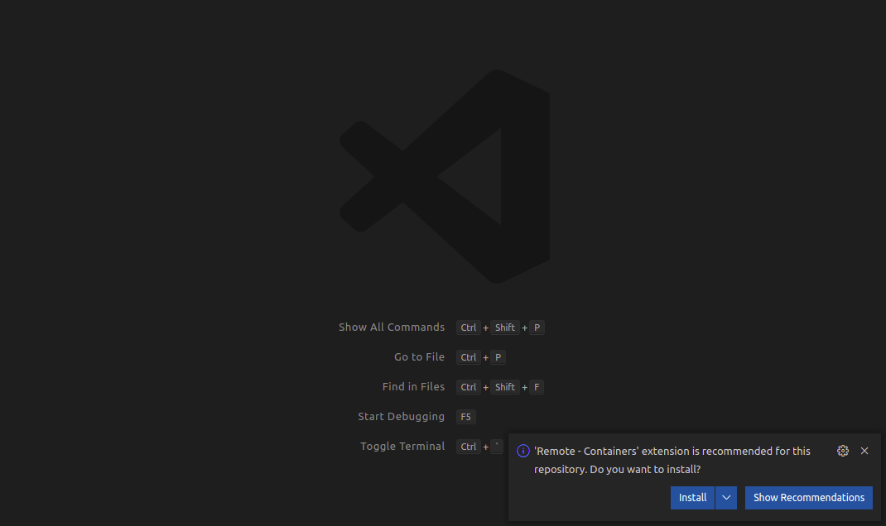
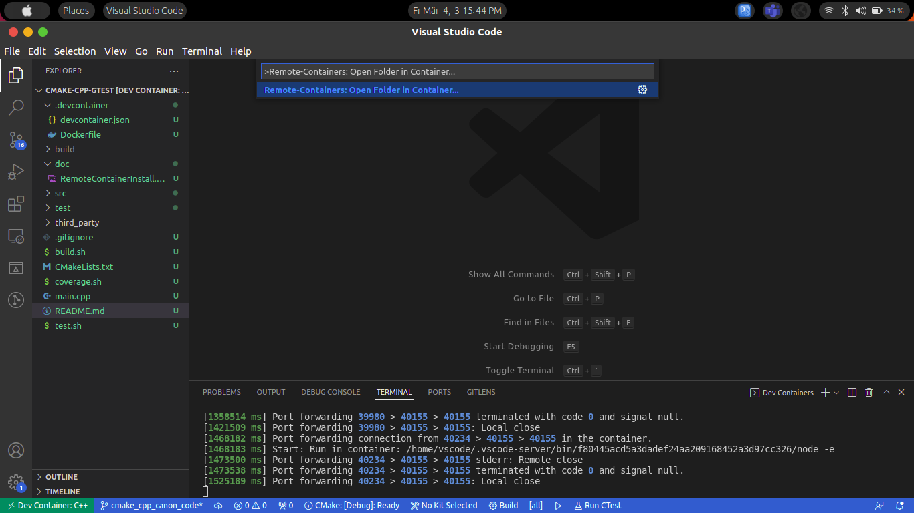

# CPP Project with CMake and Gtest

## Introduction

This is a simple CPP project with CMake and GTest using devcontainer.

To use devcontainer users need to install the following software:

* Docker: The user can install using by going to the following page. [win/mac](https://docs.docker.com/engine/install/) and [ubuntu](https://docs.docker.com/engine/install/ubuntu/)
* VSCode: The user can install vscode by going to the following [page](https://code.visualstudio.com/Download).

Once both software is installed then clone the repository into the computer and open using the vscode. Once the repository is open, on the bottom right side it will pop up for installing the extension for the '[Remote - Container](https://marketplace.visualstudio.com/items?itemName=ms-vscode-remote.remote-containers)' Install the extension. (Note: If it did not pop go to the extension in vscode and installed the extension)

After that click "ctrl + shift + p" to open the Command Palette. and type "Remote-Containers: Open Folder in Container...". After that, it will reopen the vscode and then start building the docker and installed all the software required for the project. (Note: It may take up to 5 minutes to install all the software)

## Devcontainer

By default, a non-root user (vscode) is enabled and could be configured in [devcontainer.json](.devcontainer/devcontainer.json)

### Installed Extensions

In devcontainer following extenstion are installed

* [C/C++](https://marketplace.visualstudio.com/items?itemName=ms-vscode.cpptools)
* [C/C++ Extension Pack](https://marketplace.visualstudio.com/items?itemName=ms-vscode.cpptools-extension-pack)
* [CMake Tools
](https://marketplace.visualstudio.com/items?itemName=ms-vscode.cmake-tools)
* [C++ Intellisense](https://marketplace.visualstudio.com/items?itemName=austin.code-gnu-global)
* [GitLens — Git supercharged](https://marketplace.visualstudio.com/items?itemName=eamodio.gitlens)
* [GitKraken Authentication](https://marketplace.visualstudio.com/items?itemName=gitkraken.gitkraken-authentication)
* [Markdown Preview Github Styling](https://marketplace.visualstudio.com/items?itemName=bierner.markdown-preview-github-styles)
* [markdownlint](https://marketplace.visualstudio.com/items?itemName=DavidAnson.vscode-markdownlint)
* [Markdown Preview Enhanced](https://marketplace.visualstudio.com/items?itemName=shd101wyy.markdown-preview-enhanced)
* [Markdown All in One](https://marketplace.visualstudio.com/items?itemName=yzhang.markdown-all-in-one)

### Installed Software in Docker

Also In .devcontainer in DockerFile, we have installed

* lcov - For the coverage report generation
* libssl - For pre-requisite for the installing CMake
* CMake - Installed version CMake-3.22.2

## Code execution

Once Code is open in the devcontainer then open the terminal in the vscode and run the following command:

* `./build.sh`: To build the code and get the executable for the test file. It will create the build folder and inside which it will create all the library and executables.
* `./test.sh`: To execute the test cases.
* `./coverage.sh`: To run the coverage and it will store inside the `build/report` and can view opening the `build/report/index.html`
